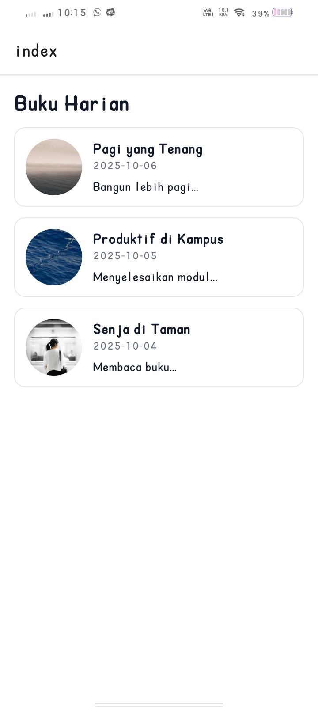
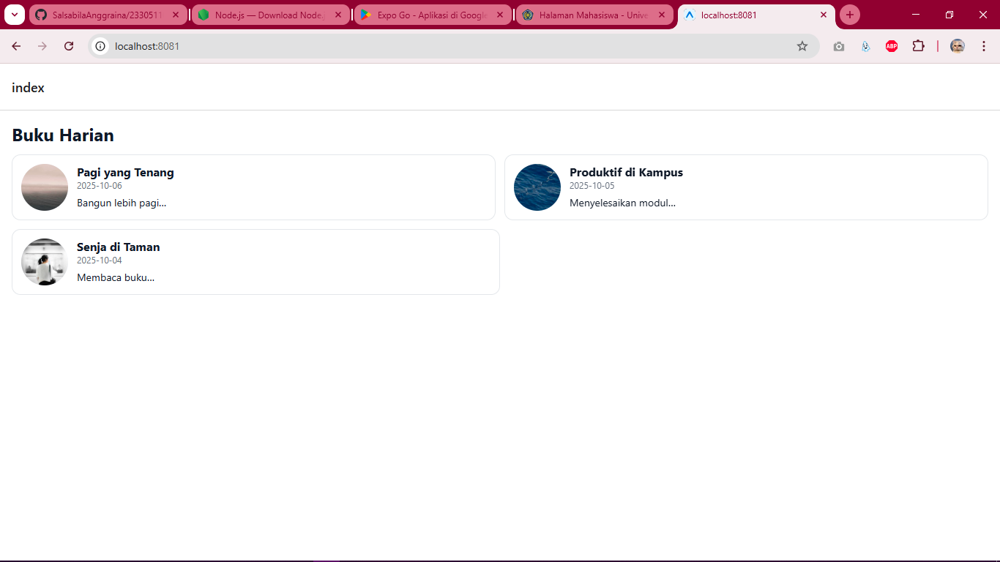

# Praktikum React Native – Design Tokens, FlatList, dan Modal

## Cara Menjalankan

1. Pastikan sudah menginstal **Node.js**, **npm**, dan **Expo CLI**.
   Jalankan verifikasi versi di terminal:

   ```bash
   node -v
   npm -v
   npx expo --version
   ```
2. Jalankan proyek:

   ```bash
   npm start
   ```

   atau

   ```bash
   npx expo start
   ```
3. Pilih mode:

   * **Emulator Android (AVD)** di Android Studio, atau
   * **Expo Go App** di perangkat fisik dengan scan QR code.
4. Setelah berhasil, aplikasi akan menampilkan halaman **Buku Harian** berisi daftar entri yang bisa diklik.

---

## Perangkat Uji

* **Laptop:** Windows 10
* **Emulator:** Android Studio (Pixel 6 API 34)
* **Perangkat Fisik:** Android 13 (Expo Go)
* **Resolusi Uji:** 1 kolom (mobile) dan 2 kolom (tablet/web, width ≥ 600px)

---

## 🎨 Implementasi & Fitur

### Design Tokens

File `src/styles/tokens.js` digunakan untuk menyimpan gaya global seperti **warna (COLORS)**, **jarak (SPACE)**, **radius (RADIUS)**, dan **ukuran teks (TYPO)** agar seluruh komponen konsisten dan mudah dikontrol.

### DiaryCard (Refactor StyleSheet)

Komponen `DiaryCard.js` menggunakan `StyleSheet` dengan variabel token. Didesain fleksibel untuk dua varian tampilan: **list** (satu kolom) dan **grid** (dua kolom). Aksesibilitas ditingkatkan dengan `accessibilityLabel`, warna teks kontras, dan area sentuh yang cukup besar menggunakan `Pressable`.

### FlatList Responsif

Komponen `DiaryListScreen.js` menampilkan daftar entri dengan **FlatList**. Layout berubah otomatis:

* **1 kolom** di layar ponsel.
* **2 kolom** di tablet/web (`width ≥ 600`).
  Responsivitas dikontrol menggunakan `useWindowDimensions()` dan `BREAKPOINTS.tablet`.

### DiaryDetailModal

Komponen `DiaryDetailModal.js` menampilkan detail entri dalam **Modal** saat kartu ditekan. Modal berisi gambar, judul, tanggal, isi catatan, dan tombol **Tutup**. Ditambahkan gaya visual menggunakan token agar konsisten dengan tampilan utama.

### Integrasi di App.js

Komponen utama `DiaryListScreen` di-render di dalam `App.js` dengan `SafeAreaView` untuk menjaga area aman di berbagai perangkat.

---

## Aksesibilitas

* **accessibilityLabel** diterapkan pada setiap kartu agar pembaca layar dapat mengenali konten.
* Warna teks dan latar mengikuti kontras yang baik antara **COLORS.text** dan **COLORS.surface**.
* **Pressable** memberikan area sentuh yang cukup luas untuk interaksi nyaman.
* **Ripple effect (Android)** membantu memberi umpan balik visual saat ditekan.

---

## Screenshot

| Mode                     | Tampilan                               |
| ------------------------ | -------------------------------------- |
| **Smartphone (1 kolom)**     |  |
| **Web (2 kolom)** |  |

---

## Ringkasan Belajar

Dalam praktikum ini, saya belajar menerapkan **design tokens** agar gaya aplikasi lebih konsisten dan mudah diatur di seluruh komponen. Saya juga memahami penggunaan **FlatList** yang dapat menyesuaikan jumlah kolom secara otomatis berdasarkan lebar layar, menciptakan tampilan responsif di berbagai perangkat.
Pembuatan **DiaryDetailModal** memperkenalkan konsep navigasi berbasis modal untuk menampilkan detail data tanpa berpindah halaman. Selain itu, penerapan prinsip **aksesibilitas** meningkatkan kenyamanan pengguna dengan pembacaan label dan kontras warna yang jelas. Praktikum ini memperdalam pemahaman saya tentang arsitektur gaya terstruktur, responsivitas layout, dan pengalaman pengguna yang inklusif dalam pengembangan aplikasi React Native modern.
